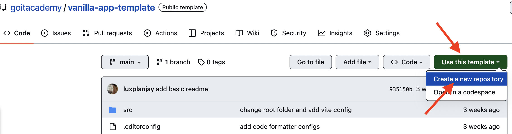

# Домашнє завдання №12

+ Створи репозиторій `js-hw-12`.
+ Збери проєкт за допомогою [Vite](https://vitejs.dev/). Ми підготували для тебе [готову збірку](https://github.com/goitacademy/vanilla-app-template) з усіма додатковими налаштуваннями проєкту та рекомендуємо використовувати саме її.
+ Прочитай завдання і виконай його в редакторі коду.
+ Переконайся, що код відформатований за допомогою `Prettier`, а в консолі відсутні помилки й попередження під час відкриття живої сторінки завдання.
+ Здай домашнє завдання на перевірку.

**Формат здачі:** Домашня робота містить два посилання: на вихідні файли і робочу сторінку на `GitHub Pages`.

## Файли і папки

> ! Зверни увагу! Імена файлів та папок, а також їх структура вкладеності, мають відповідати вказаній схемі. В іншому разі робота не буде прийнята.

Структура папок і файлів проєкту в папці `src` має виглядати таким чином:

 

- Файли розмітки компонентів сторінки повинні лежати в папці `src` та  імпортуватись до файлу `index.html`. 
- Файли стилів повинні лежати в папці `src/css` та імпортуватись до HTML-файлів сторінок. Наприклад, для `index.html` файл стилів називається `styles.css`.
- Зображення додавай до папки `src/img`. Збирач оптимізує їх, але тільки при деплої продакшн версії проекту. Все це відбувається у хмарі, щоб не навантажувати твій комп'ютер, тому що на слабких компʼютерах це може зайняти
багато часу.

Для організації коду використовуй модульність та синтаксис export/import:

+ У файлі pixabay-api.js зберігай функції для HTTP-запитів.
+ У файлі render-functions.js створи функції для відображення елементів інтерфейсу.
+ У файлі main.js напиши всю логіку роботи додатка.

**Завдання — Пошук зображень**

Створи застосунок пошуку зображень за ключовим словом і їх перегляду в галереї. Додай оформлення елементів інтерфейсу згідно з макетом.

> ! Для стилізації розмітки твоїх завдань використовуй цей [макет](https://www.figma.com/file/m8k9NQV7qZrtYDCvxfD68B/%D0%94%D0%97-JavaScript?type=design&node-id=3-1009&mode=design&t=eCh8cUwdfWOakuAr-0).

**Форма пошуку**

Форма пошуку міститься в HTML-документі. Користувач буде вводити рядок для пошуку в текстове поле, а за сабмітом форми необхідно виконувати HTTP-запит із цим пошуковим рядком.

При натисканні на кнопку відправки форми, додайте перевірку вмісту текстового поля на наявність порожнього рядка, щоб користувач не міг відправити запит, якщо поле пошуку порожнє.

**HTTP-запити**

Для бекенду використовуй публічний API сервіс [Pixabay](https://pixabay.com/api/docs/). Зареєструйся, отримай свій унікальний ключ доступу і ознайомся з [документацією](https://pixabay.com/api/docs/#api_search_images).

Список параметрів рядка запиту, які тобі обов'язково необхідно вказати:
+ `key` — твій унікальний ключ доступу до API.
+ `q` — слово для пошуку. Те, що буде вводити користувач.
+ `image_type` — тип зображення. Потрібні тільки фотографії, тому постав значення photo.
+ `orientation` — орієнтація фотографії. Постав значення `horizontal`.
+ `safesearch` — фільтр за віком. Постав значення `true`.
У відповіді буде об’єкт із декількома властивостями, в одному з яких буде масив зображень, що задовольнили критерії параметрів запиту.

Якщо бекенд повертає порожній масив, значить, нічого підходящого не було знайдено. У такому разі показуй повідомлення з текстом `"Sorry, there are no images matching your search query. Please try again!"`. Для повідомлень використовуй бібліотеку [iziToast](https://izitoast.marcelodolza.com/).
Для того щоб підключити CSS код бібліотеки в проєкт, необхідно додати ще один імпорт, крім того, що описаний у документації.

```JavaScript
// Описаний у документації
import iziToast from "izitoast";
// Додатковий імпорт стилів
import "izitoast/dist/css/iziToast.min.css";
```

Подивись демовідео роботи застосунку на цьому етапі.

https://www.youtube.com/watch?v=4tGWr0Q7HV0 

** Галерея і картки зображень **

Елемент галереї (список однотипних елементів) міститься в HTML-документі, і в нього необхідно додавати розмітку карток зображень після HTTP-запитів.

Кожне зображення описується об'єктом, з якого тобі цікаві тільки такі властивості:

+ `webformatURL` — посилання на маленьке зображення для списку карток у галереї
+ `largeImageURL` — посилання на велике зображення для модального вікна
+ `tags` — рядок з описом зображення. Підійде для атрибута `alt`
+ `likes` — кількість вподобайок
+ `views` — кількість переглядів
+ `comments` — кількість коментарів
+ `downloads` — кількість завантажень
Перед пошуком за новим ключовим словом необхідно повністю очищати вміст галереї, щоб не змішувати результати запитів.

Подивись демовідео роботи застосунку на цьому етапі.

https://www.youtube.com/watch?v=n-crt20j5I8

**Бібліотека SimpleLightbox**

Додай відображення великої версії зображення з бібліотекою [SimpleLightbox](https://dbrekalo.github.io/simpleLightbox/) для повноцінної галереї.

Для того щоб підключити CSS код бібліотеки в проєкт, необхідно додати ще один імпорт, крім того, що описаний у документації.

```JavaScript
// Описаний у документації
import SimpleLightbox from "simplelightbox";
// Додатковий імпорт стилів
import "simplelightbox/dist/simple-lightbox.min.css";
```

У розмітці необхідно буде обгорнути кожну картку зображення в посилання, як зазначено в документації в [секції «Markup»](https://github.com/andreknieriem/simplelightbox#markup).
Бібліотека містить метод [refresh()](<https://github.com/andreknieriem/simplelightbox#public-methods>), який обов'язково потрібно викликати щоразу після додавання нових елементів до галереї.

Подивись демовідео роботи застосунку на цьому етапі.

https://www.youtube.com/watch?v=DVKNqtbZVGc

**Індикатор завантаження**

Додай елемент, що сповіщає користувача про те, що йде процес завантаження зображень з бекенду. Завантажувач має з’являтися прямо перед початком HTTP запиту та зникати після того, як запит завершився.

Подивись демовідео роботи застосунку на цьому етапі.

https://www.youtube.com/watch?v=o981M1AqZ1s 

Замість банального тексту, як це реалізовано в демовідео, можна використовувати бібліотеку з гарними індикаторами завантаження, наприклад, [css-loader](https://github.com/vineethtrv/css-loader). Відеоінструкція з використання цієї бібліотеки є в [README.md](https://github.com/vineethtrv/css-loader/blob/master/README.md) їхнього репозиторію.

**Додатково**

> ! Увага
> Наступний функціонал не обов'язковий для здавання завдання, але буде хорошою додатковою практикою.

**Повідомлення**

Після першого запиту з кожним новим пошуком отримувати повідомлення, в якому буде написано, скільки всього знайшли зображень (властивість `totalHits`). Текст повідомлення - `"Hooray! We found totalHits images."`

Реалізовано також повідомлення - `"Please enter a value in the search field!"`. Тобто запит з пустим полем неможливий.

**На що буде звертати увагу ментор при перевірці:**

+ Домашня робота містить два посилання: на вихідні файли і живу сторінку на `GitHub Pages`
+ Проєкт зібраний за допомогою [Vite](https://vitejs.dev/)
+ Консоль в інструментах розробника не містить помилок, попереджень і консоль логів
+ До проєкту підключені бібліотеки iziToast, SimpleLightbox та css-loader
+ Елементи на сторінці стилізовані згідно з макетом (або власні стилі)
+ На сторінці присутня форма пошуку зображень за пошуковим словом
+ При сабміті форми перед відправкою запиту на бекенд з’являється індикатор завантаження з css-loader та очищаються попередні результати пошуку на сторінці
+ При сабміті форми відправляється запит на бекенд по ключовому слову для пошуку зображень з усіма параметрами, що вказані в ТЗ
+ Після отримання відповіді від бекенда зникає індикатор завантаження та на сторінці відмальовуються зображення на основі отриманих даних від бекенду, або з’являється повідомлення про те, що підходящих результатів не було знайдено
+ Нові зображення додаються в DOM за одну операцію
+ Після додавання нових елементів до списку зображень на екземплярі SimpleLightbox викликається метод `refresh()`
+ При кліку на маленьке зображення в галереї відкривається його збільшена версія у модальному вікні з використанням бібліотеки SimpleLightbox
+ Під час виконання HTTP-запитів використовуються обробники **then()** та **catch()**, щоб опрацьовувати можливі помилки та запобігти “падінню” сторінки


# Vanilla App Template

Цей проект було створено за допомогою Vite. Для знайомства та налаштування
додаткових можливостей [звернись до документації](https://vitejs.dev/).

## Створення репозиторію за шаблоном

Використовуй цей репозиторій організації GoIT як шаблон для створення
репозиторію свого проекту. Для цього натисни на кнопку `«Use this template»` і
обери опцію `«Create a new repository»`, як показано на зображенні.



На наступному етапі відкриється сторінка створення нового репозиторію. Заповни
поле його імені, переконайся, що репозиторій публічний, після чого натисни
кнопку `«Create repository from template»`.


Після того, як репозиторій буде створено, необхідно перейти в налаштування
створеного репозиторію на вкладку `Settings` > `Actions` > `General` як показано
на зображенні.


Проскроливши сторінку до самого кінця, в секції `«Workflow permissions»` обери
опцію `«Read and write permissions»` і постав галочку в чекбоксі. Це необхідно
для автоматизації процесу деплою проекту.


Тепер у тебе є особистий репозиторій проекту, зі структурою файлів та папок
репозиторію-шаблону. Далі працюй з ним, як з будь-яким іншим особистим
репозиторієм, клонуй його собі на комп'ютер, пиши код, роби коміти та відправляй
їх на GitHub.

## Підготовка до роботи

1. Переконайся, що на комп'ютері встановлено LTS-версію Node.js.
   [Скачай та встанови](https://nodejs.org/en/) її якщо необхідно.
2. Встанови базові залежності проекту в терміналі командою `npm install`.
3. Запусти режим розробки, виконавши в терміналі команду `npm run dev`.
4. Перейдіть у браузері за адресою
   [http://localhost:3000/](http://localhost:3000/). Ця сторінка буде автоматично
   перезавантажуватись після збереження змін у файли проекту. 
   Даний Port вказаний в налаштуваннях файла конфігурації `vite.config.js`.
   Можна прибрати в налаштуваннях вказаний Port, тоді адреса за замовчуванням для локального сервера під час розробки [http://localhost:5173](http://localhost:5173).

## Деплой

Продакшн версія проекту буде автоматично збиратися та деплоїтись на GitHub
Pages, у гілку `gh-pages`, щоразу, коли оновлюється гілка `main`. Наприклад,
після прямого пуша або прийнятого пул-реквесту. Для цього необхідно у файлі
`package.json` змінити значення прапора `--base=/<REPO>/`, для команди `build`,
замінивши `<REPO>` на назву свого репозиторію, та відправити зміни на GitHub.

```json
"build": "vite build --base=/<REPO>/",
```

Далі необхідно зайти в налаштування GitHub-репозиторію (`Settings` > `Pages`) та
виставити роздачу продакшн версії файлів з папки `/root` гілки `gh-pages`, якщо
це не було зроблено автоматично.


### Статус деплою

Статус деплою крайнього коміту відображається іконкою біля його ідентифікатора.

- **Жовтий колір** - виконується збірка та деплой проекту.
- **Зелений колір** - деплой завершився успішно.
- **Червоний колір** - під час лінтингу, збірки чи деплою сталася помилка.

Більш детальну інформацію про статус можна переглянути натиснувши на іконку, і в
вікні, що випадає, перейти за посиланням `Details`.


### Жива сторінка

Через якийсь час, зазвичай кілька хвилин, живу сторінку можна буде подивитися за
адресою, вказаною на вкладці `Settings` > `Pages` в налаштуваннях репозиторію.
Наприклад, ось посилання на живу версію для цього репозиторію

[https://goitacademy.github.io/vanilla-app-template/](https://goitacademy.github.io/vanilla-app-template/).

Якщо відкриється порожня сторінка, переконайся, що у вкладці `Console` немає
помилок пов'язаних з неправильними шляхами до CSS та JS файлів проекту
(**404**). Швидше за все у тебе неправильне значення прапора `--base` для
команди `build` у файлі `package.json`.

## Як це працює


1. Після кожного пуша у гілку `main` GitHub-репозиторію, запускається
   спеціальний скрипт (GitHub Action) із файлу `.github/workflows/deploy.yml`.
2. Усі файли репозиторію копіюються на сервер, де проект ініціалізується та
   проходить лінтинг та збірку перед деплоєм.
3. Якщо всі кроки пройшли успішно, зібрана продакшн версія файлів проекту
   відправляється у гілку `gh-pages`. В іншому випадку, у лозі виконання скрипта
   буде вказано в чому проблема.